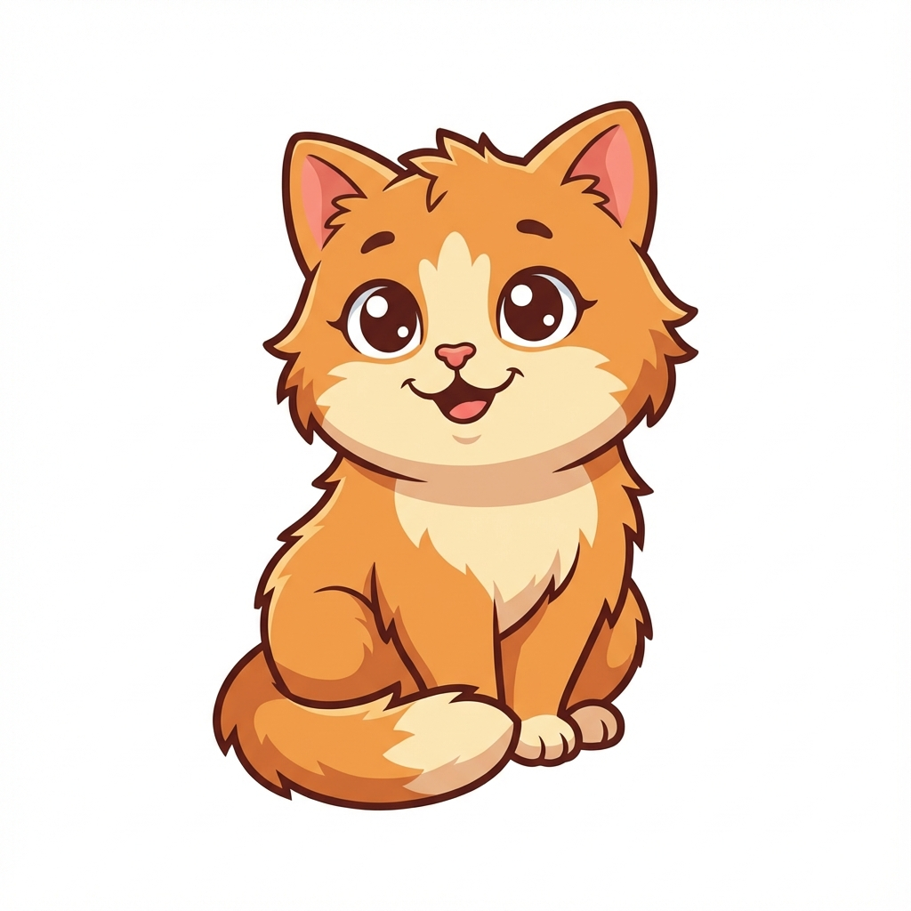

# 🐱 CatSay GUI

A delightful desktop GUI application written in Rust that displays a cat delivering your messages in a fun, interactive way. Choose between a happy cat or a "dead" cat (cartoon style) to deliver your custom messages!



## ✨ Features

- 🎨 **Modern Cross-Platform GUI** - Built with `eframe` (egui), runs natively on Windows, macOS, and Linux
- 🐈 **Two Cat States** - Toggle between a happy cat and a humorous "dead" cat
- 💬 **Custom Messages** - Type any message and see the cat deliver it
- 🚀 **No System Dependencies** - Pure Rust implementation, no GTK or Qt required
- 🎯 **Simple & Intuitive** - Clean interface that anyone can use

## 🛠️ Prerequisites

- **Rust** 1.70+ (Install from [rustup.rs](https://rustup.rs/))
- No other dependencies required! 🎉

## 📦 Installation

### Option 1: Clone and Build

```bash
# Clone the repository
git clone <repository-url>
cd gui

# Build and run
cargo run --release
```

### Option 2: Build Only

```bash
# Build the application
cargo build --release

# The executable will be in target/release/gui.exe (Windows)
# or target/release/gui (Unix-like systems)
```

## 🎮 Usage

1. **Launch the application**
   ```bash
   cargo run
   ```

2. **Enter your message** in the text field

3. **Toggle "Is Dead"** checkbox to switch between cat states

4. **Click "Generate"** to display the cat with your message

## 🏗️ Project Structure

```
gui/
├── src/
│   └── main.rs          # Main application code
├── images/
│   ├── cat.png          # Happy cat image
│   └── cat_dead.png     # "Dead" cat image
├── Cargo.toml           # Project configuration
└── README.md            # This file
```

## 🔧 Technical Details

### Dependencies

- **eframe** (v0.29) - Cross-platform GUI framework built on egui
- **image** (v0.25) - Image loading and processing

### Architecture

The application uses the immediate mode GUI paradigm provided by egui:
- **Reactive UI** - UI updates automatically when state changes
- **Efficient Rendering** - Only redraws when necessary
- **Memory Safe** - All Rust's safety guarantees apply

## 🎨 Customization

### Changing Cat Images

Replace the images in the `images/` directory:
- `cat.png` - Happy/alive cat (any size, will be scaled)
- `cat_dead.png` - "Dead" cat (any size, will be scaled)

Supported formats: PNG, JPEG, GIF, BMP, ICO, TIFF, WebP

### Modifying UI

Edit `src/main.rs`:
- Window size: Modify `with_inner_size([600.0, 500.0])`
- Colors: Change `egui::Color32::from_rgb(r, g, b)`
- Layout: Adjust spacing with `ui.add_space(pixels)`

## 🐛 Troubleshooting

### Images Not Displaying

**Problem**: You see "⚠️ Image not found" message

**Solution**: Ensure the `images/` folder exists in the same directory as the executable:
```bash
mkdir -p images
# Copy your cat images to the images/ folder
```

### Build Errors

**Problem**: Compilation fails

**Solution**:
```bash
# Clean and rebuild
cargo clean
cargo build
```

## 📝 License

This project is open source and available under the MIT License.

## 🙏 Acknowledgments

- Built with [egui](https://github.com/emilk/egui) - An easy-to-use immediate mode GUI in Rust
- Inspired by the classic `cowsay` Unix command
- Cat images generated with AI

## 🚀 Future Enhancements

- [ ] Multiple cat characters to choose from
- [ ] Animated cat movements
- [ ] Speech bubble styling options
- [ ] Save/export cat messages as images
- [ ] Message history
- [ ] Custom cat image upload

---

